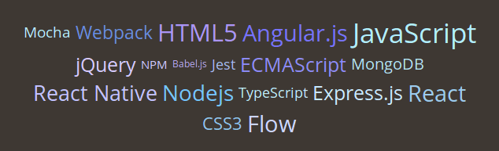

# react-tagcloud

Simple and extensible tag/word cloud React component.

You can find demo on [preview page](https://madox2.github.io/react-tagcloud/).



## Installation

```
npm install react-tagcloud
```

## Basic usage

```javascript
import { TagCloud } from "react-tagcloud";

const data = [
  { value: "JavaScript", count: 38 },
  { value: "React", count: 30 },
  { value: "Nodejs", count: 28 },
  { value: "Express.js", count: 25 },
  { value: "HTML5", count: 33 },
  { value: "MongoDB", count: 18 },
  { value: "CSS3", count: 20 }
];

const SimpleCloud = () => (
  <TagCloud minSize={12}
            maxSize={35}
            tags={data}
            onClick={tag => alert(`'${tag.value}' was selected!`)} />
);
```

## API

### Options

`<TagCloud />` component accepts options listed below:

| Option | Type | Required | Note |
|-----------|----------|--------|---|
|`tags`                 |`Array`   |`true`|Array of objects representing tags (see [Tag object](#tag-object))|
|`maxSize`              |`Number`  |`true` |Maximal font size (px) used in cloud|
|`minSize`              |`Number`  |`true` |Minimal font size (px) used in cloud|
|`shuffle`              |`Boolean` |`false`|If true, tags are shuffled. When `tags` are modified, cloud is re-shuffled. Default: `true`|
|`randomNumberGenerator`|`Function`|`false`|Specifies a custom random number generator that is being used by shuffle algorithm. Default: `Math.random`
|`colorOptions`         |`Object`  |`false`|Random color options (see [randomColor#options](https://github.com/davidmerfield/randomColor#options))|
|`disableRandomColor`   |`Boolean` |`false`|If `true`, random color is not used|
|`renderer`             |`Function`|`false`|Function used to render each tag|

*Note:* Furthermore you can pass any other option and it will be passed forward to the wrapping `<div />` component (e.g. `style`, `className`).

### Tag object

Each tag is represented by object containing properties:

| Property | Type | Required | Note |
|----------|------|----------|------|
|`value`|`String`|`true` |String value to be displayed|
|`count`|`Number`|`true` |Represents frequency of the tag. It is used to calculate tag size|
|`key`  |`String`|`false`|Tag element key. If it is not provided, `value` property will be used instead (however it can fail if you don't have unique tag values. It is highly recommed to use `key` property if you are not sure that tag value is unique)|
|`color`|`String`|`false`|Represents color of the tag. If it is not provided, random color will be used instead|

### Events

Event handlers can be passed to the `<TagCloud />` props.
Each handler has two arguments: the first is related tag object and the second is DOM event object.

Currently supported events: `onClick`, `onDoubleClick`, `onMouseMove`

*Note:* Feel free to open issue if any other event is needed.

### Styles

Default class names are `tag-cloud` for wrapping container, and `tag-cloud-tag` for particular tag.
Styles passed to `<TagCloud />` props will be applied to wrapping container.

### Renderer

Rendering of tags can be fully customized by providing custom render function and passing it to the `renderer` prop.
By default is used [defaultRenderer](https://github.com/madox2/react-tagcloud/blob/master/src/defaultRenderer.js).
Render function has three arguments - `tag`, `size` and `color`.
For example:

```javascript
import { TagCloud } from "react-tagcloud";

const customRenderer = (tag, size, color) => {
  return <span key={tag.value} style={{color}} className={`tag-${size}`}>{tag.value}</span>;
};

const CustomizedCloud () => (
  <TagCloud tags={data}
            minSize={1}
            maxSize={5}
            renderer={customRenderer} />
);
```

## More examples

* [Simple tag cloud](https://github.com/madox2/react-tagcloud/blob/master/examples/src/simple-cloud.js)
* [Custom color options](https://github.com/madox2/react-tagcloud/blob/master/examples/src/custom-color-options.js)
* [Custom styles](https://github.com/madox2/react-tagcloud/blob/master/examples/src/custom-styles.js)
* [Custom renderer](https://github.com/madox2/react-tagcloud/blob/master/examples/src/custom-renderer.js)

## Testing

Install dev modules:

```
npm install
```

### Run unit tests

```
npm test
```

### Run examples

```
cd examples
npm install
npm start
```

and open browser at `http://localhost:3000`

## License

[MIT License](https://github.com/madox2/react-tagcloud/blob/master/LICENSE)
